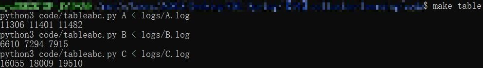

# Learning Coalition Structures with Games

## Table of Contents

- [General Information](#general-information)
- [Screenshots](#screenshots)
- [File Structure](#file-structure)
- [Reproducing the Experiments](#reproducing-the-experiments)

## General Information

This repository contains the source code for the experiments in the AAAI 2024 paper: [Learning Coalition Structures with Games](https://arxiv.org/abs/2312.09058). We implemented AuctionIG (Algorithm 2) and tested its performance under several conditions.

## Screenshots

Results in Table 2, produced by the scripts:



## File Structure

The repository contains the following directories:

- `code`: the source code of the algorithms and the scripts to analyze the results.
- `figures`: the figures used in the paper.
- `logs`: the logs of the experiments.

## Reproducing the Experiments

We have written a set of scripts so that the experiments are easily reproduced. Although the source code of algorithms is cross-platform, the scripts use `bash` and `make`, so they only work under Linux-like systems (including Windows Subsystem for Linux).

- To re-run the main experiments, enter

  ``` bash
  make runall
  ```

- To generate the figures used in the paper, enter

  ``` bash
  make plots
  ```

- To generate the tables used in the paper, enter

  ``` bash
  make tables
  ```
  